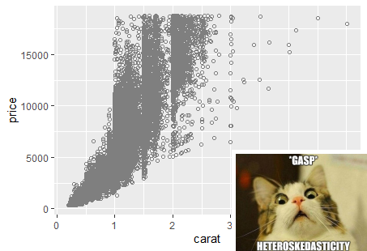

```{r setup, include=FALSE}
knitr::opts_chunk$set(echo = FALSE)
knitr::opts_chunk$set(fig.width=9, fig.height=5) 

library(dplyr)
library(ggplot2)
library(lfe)
library(stargazer)
library(robustbase)
library(wooldridge)
library(magick)
library(lm.beta)
```

## Odds and Ends

- Non-Standard Standard Errors

    - Robust standard errors

    - Clustered standard errors
    
    - Newey West Standard Errors
    
    - Conley Standard errors
    
- Confidence intervals for prediction

    - For a particular average
    
    - For a particular unit
    
- Standardizing


## Non-standard standard errors

A standard error estimates the uncertainty around an estimated parameter. 

Formally we have
$$
se=\sqrt{\widehat{Var(\hat{\beta})}}. 
$$


Just like calculating point estimates, it is incredibly important to get your standard errors right. 

You have to know what you don't know!

- Robust standard errors

- Clustered standard errors


## Robust standard errors

Using the diamonds data set from `ggplot2`: 

\tiny
```{r robust, echo=TRUE}

knitr::kable(head(diamonds))
```

## Robust standard errors

Regress price on carats and depth.

\tiny
```{r robusta, echo=TRUE}

reg1<-felm(price~carat+depth, diamonds)

summary(reg1)
```

## Robust standard errors

Cool. 

Plot  the data to check OLS assumptions:

\tiny
```{r rob, echo=TRUE}

myPlot <- ggplot(data = diamonds, aes(y = price, x = carat)) +
geom_point(color = "gray50", shape = 21) 

```


## Robust standard errors

```{r}


imgin <- image_read("images/scared_cat.jpg")
imgout <- image_read("images/Rplot01.png")

img_inset <- image_scale(imgin, "27%x") %>% 
  image_border("white", "5x5")

img_with_inset <- imgout %>% image_composite(
  img_inset,
  operator = "Atop",
  gravity = "SouthEast",
  offset = "-10-10"
)

image_write(img_with_inset, "img_with_inset.png")
```


```{r}

```


## Robust standard errors


You should have the econometric heebie jeebies.

Homoskedastic assumption needed for OLS is not valid!

- The higher the carat, the greater the variance in price. 

- $\Rightarrow$ OLS standard errors are likely to be wrong. 

Thankfully all is not lost!

## Robust standard errors

Lets relax the homoskedasticity assumption and allow for the variance to depend on the value of $x_i$. 


We know that 
$$
Var(\hat{\beta_1})=\frac{\sigma^2}{\sum_{i=1}^n(x_i-\bar{x})^2}=\frac{\sum_{i=1}^n(x_i-\bar{x})^2\sigma^2}{(\sum_{i=1}^n(x_i-\bar{x})^2)^2}
$$


With heteroskedasticity $\sigma^2$ is no longer constant and becomes a function of the particular value of $x_i$ an observation has, so 

$$
Var(u_i|x_i)=\sigma^2_i
$$

Where are we going to find all these $\sigma_i^2$ for each individual observation?


## Eicker, Huber and White to the rescue!


Econometricians Eicker, Huber and White figured out a way to do this by basically using the square of the estimated residual of each observation, $\hat{u}_i^2$, as a stand-in for $\sigma^2_i$. 

With this trick, a valid estimator for $Var(\hat{beta_1})$, with heteroskedasticity of **any** form (including homoskedasticity), is 

$$
Var(\hat{\beta_1})=\frac{\sum_{i=1}^n(x_i-\bar{x})^2\hat{u}_i^2}{(\sum_{i=1}^n(x_i-\bar{x})^2)^2}
$$

We commonly call the resulting standard errors "robust", or "heteroskedasticity-robust".


## Robust standard errors

How can we find these in R? 

 \tiny
```{r robustaa, echo=TRUE}

reg1<-felm(price~carat+depth, diamonds)

summary(reg1, robust=TRUE)
```

## Robust standard errors

Or if you want to put them in a stargazer table:
\tiny 
```{r robustaaa, echo=TRUE, results="asis"}

stargazer(reg1, type = "latex" , se =  list(reg1$rse), header=FALSE)
```
\normalsize
Note: robust standard errors are larger than regular standard errors, and thus more conservative (which is the right thing to be... you want to know what you don't know). 


## Econometricians Haiku


**_T-stats looks too good_**

**_Try cluster standard errors_**

**_significance gone._**

\bigskip

\small
from Angrist and Pischke 2008


## Clustered standard errors

Suppose that every observation belongs to (only) one of G groups. 

The assumption we make when we cluster:

- there is no correlation across groups

- we allow for arbitrary within-group correlation.


## Clustered standard errors

Example: consider individuals within a village.

It may be reasonable to think that individuals' error terms are:

- correlated within a village

- aren't correlated across villages 

## Clustered standard errors

I will spare you the matrix math needed to dive deeper into this. 

Suffice to say that "cluster-robust" estimates allow for a more complicated set of correlations to exist within observations within a cluster. 

One thing to be aware of though is that you will need to have a fairly large number of clusters (40+) for the estimate to be credible. 


## Clustered standard errors

Clustering in R: 

I use the `NOxEmissions` dataset from the `robustbase` package.

- hourly $NO_x$ readings, including $NO_x$ concentration, auto emissions and windspeed. 

- use the observation date as our cluster variable. 

This allows for arbitrary dependence between observations in the same day, and zero correlation across days.

Is this reasonable? ... Maybe. But we'll go with it for now: 
 

## Clustered standard errors

 \tiny
```{r clust, echo=TRUE, results="asis"}
nox <- as.data.frame(NOxEmissions) %>%mutate(ones = 1)
noClusters <- felm(data = nox, LNOx ~ sqrtWS )
Clusters <- felm(data = nox, LNOx ~ sqrtWS |0|0| julday)
stargazer(noClusters,Clusters, type = "latex" , header=FALSE, omit.stat = "all")

```

\normalsize
Here, the regular standard errors are smaller than the clustered standard errors.

This need not necessarily be the case and depends on the correlation between observations within a cluster.


## Newey West Standard Errors

For time series data.

## Conley Standard Errors

For spatial data. 


## Confidence intervals for predictions


You know how to “predict” a value of the dependent variable, $y$, given certain values of the
independent variables. 

This prediction is just a guess, with uncertainty.

We can construct a confidence interval to give a range of possible values for this prediction.

There are two kinds of predictions we can make:

- A confidence interval for the **average** $y$ given $x_1$, $x_2$... $x_k$.

- A confidence interval for a **particular** $y$ given $x_1$, $x_2$... $x_k$.


## Confidence intervals for predictions

Using Wooldridge’s birth weight data: 

$$
bweight=\beta_0+\beta_1lfaminc+\beta_2 meduc+\beta_3 parity+u
$$

- bwght is birth weight in ounces,

- lfaminc is the log of family income in $1000s, 

- meduc is the education of the mother in years, 

- parity is the birth order of the child.

## Confidence intervals for predictions

Estimating this equation in R, we get the following results:

\tiny
```{r pred, echo=TRUE}

#using the bwght data from the wooldridge package
reg1<-lm(bwght~lfaminc+motheduc+parity, bwght)

summary(reg1)

```


## Confidence intervals for predictions: for a specific average 

Our model gives us the expected value:
\small
$$
E[bweight|faminc, meduc, parity]=\beta_0+\beta_1log(faminc)+\beta_2meduc+\beta_3parity
$$
\normalsize
and our regression gives us an estimate of this:
\footnotesize
$$
\hat{E}[bweight|faminc, meduc,parity]=\hat{y}=\hat{\beta_0}+\hat{\beta_1}log(faminc)+\hat{\beta_2}meduc+\hat{\beta_3}parity
$$
\normalsize
$\hat{y}$ is the expected value of y given the particular values for the explanatory variables. 


## Confidence intervals for predictions: for a specific average 

Say we are interested in a confidence interval for the **average birthweight** for babies with:

- a family income of $14,500 (ln(14.5)=2.674), 

- mothers with 12 years of education, 

- 2 older siblings (parity=3). 
\tiny
$$
\begin{aligned}
\hat{E}[bweight|faminc=14.5, meduc=12, parity=3]&=105.66+2.13ln(faminc)+0.317meduc+1.53parity\\
\hat{y}_{faminc=14.5, meduc=12, parity=3} &= 105.66+2.13 (2.674)+0.317(12)+1.53(3)\\
&= 119.75 ounces
\end{aligned}
$$
\normalsize
How do we find a standard error for $\hat{y}$ at these particular values of the explanatory variables? 

## Confidence intervals for predictions: for a specific average 

This standard error is complicated because $\widehat{bweight}$ is a function of our $\hat{\beta}$'s which are all random variables. 

To avoid this computation, we want to transform our data.


## Confidence intervals for predictions: for a specific average 

Recall that we have the following regression in mind
$$
bweight=\beta_0+\beta_1lfaminc+\beta_2 meduc+\beta_3 parity+u
$$
Then 
$$
\hat{\beta_0}=\hat{E}(bweight|lfaminc=0, meduc=0, parity=0)
$$

## Confidence intervals for predictions: for a specific average 


If we modify the regression by subtracting our particular values from the independent variables, we get 
$$
bweight=\beta_0+\beta_1(lfaminc-2.674)+\beta_2(meduc-12)+\beta_3(parity-3)+u
$$
Then
$$
\hat{\beta_0}=\hat{E}(bweight|lfaminc=2.674, meduc=12, parity=3).
$$


The new intercept is the predicted birthweight for babies with the particular values we are interested in.

If we run this regression in `R`, we can then grab the standard errors for the intercept. 

## Confidence intervals for predictions: for a specific average 

So step by step we need to:

1) Generate new variables: $\tilde{x}_j=x_j-\alpha_j$

2) Run the regression: $y=\tilde{\beta_0}+\tilde{\beta_1}\tilde{x_1}+...+\tilde{\beta_k}\tilde{x_k}+\tilde{u}$

3) Then $\hat{E}[y|x_1=\alpha_1,...,x_k=\alpha_k]=\tilde{\beta_0}$

4) Plug these values into the formula for confidence intervals and interpret.


## Confidence intervals for predictions: for a specific average 

\tiny
```{r pred2, echo=TRUE}

#Step 1: generate new variables
bwght$lfaminc_0<-bwght$lfaminc-2.674
bwght$motheduc_0<-bwght$motheduc-12
bwght$parity_0<-bwght$parity-3

#step 2: run the new regression
reg2<-lm(bwght~lfaminc_0+motheduc_0+parity_0,bwght)

summary(reg2)

```

## Confidence intervals for predictions: for a specific average 

The 95% confidence interval for the average birthweight for babies given a family income of $14,500, a mother with 12 years of education and with 2 older siblings is:

$$
[119.64-1.96(1.007), 119.64+1.96(1.007)]=[117.6653,121.6158]
$$


## Confidence Interval for prediction: a specific unit

A confidence interval for a particular average is not the same as a confidence interval for a particular individual. 

For individual observations, we must account for the variance in the unobserved error, $u_i$, which measures our ignorance of the unobserved factors that affect $y_i$.

## Confidence Interval for prediction: a specific unit

We want a confidence interval for $bweight_{i=1}$, the birthweight of baby $i=1$, with 
$$
bweight_{i=1}=\beta_0+\beta_1lfaminc_{i=1}+\beta_2meduc_{i=1}+\beta_3parity_{i=1}+u_{i=1}
$$
Our best prediction of $bweight_{i=1}$ is $\widehat{bwieght}_{i=1}$ where 
$$
\widehat{bweight}_{i=1}=\hat{\beta}_0+\hat{\beta}_1lfaminc_{i=1}+\hat{\beta}_2meduc_{i=1}+\hat{\beta}_3parity_{i=1}
$$

## Confidence Interval for prediction: a specific unit

There is some error, $\hat{u}_{i=1}$, associated with using $\widehat{bweight}_{i=1}$ to predict $bweight_{i=1}$ where 

$$
\begin{aligned}
\hat{u}_{i=1}&=bweight_{i=1}-\widehat{bweight}_{i=1}\\
&=(\beta_0+\beta_1lfaminc_{i=1}+\beta_2meduc_{i=1}+\beta_3parity_{i=1}+u_{i=1})\\
&-(\hat{\beta}_0+\hat{\beta}_1lfaminc_{i=1}+\hat{\beta}_2meduc_{i=1}+\hat{\beta}_3parity_{i=1})
\end{aligned}
$$


Finding the expected value, we get: 
\footnotesize
$$
\begin{aligned}
E[\hat{u}_{i=1}]&=E[bweight_{i=1}-\widehat{bweight}_{i=1}]\\
&=(\beta_0+\beta_1lfaminc_{i=1}+\beta_2meduc_{i=1}+\beta_3parity_{i=1}+E[u_{i=1}])\\
&-(E[\hat{\beta}_0]+E[\hat{\beta}_1]lfaminc_{i=1}+E[\hat{\beta}_2]meduc_{i=1}+E[\hat{\beta}_3]parity_{i=1})\\
&=0
\end{aligned}
$$

## Confidence Interval for prediction: a specific unit

Finding the variance we get
\footnotesize
$$
\begin{aligned}
Var(\hat{u}_{i=1})&=Var(bweight_{i=1}-\widehat{bweight}_{i=1})\\
&=Var(\beta_0+\beta_1lfaminc_{i=1}+\beta_2meduc_{i=1}+\beta_3parity_{i=1}+u_{i=1}-\widehat{bweight}_{i=1})\\
&=Var(\widehat{bweight}_{i=1})+Var(u_{i=1})\\
&=Var(\widehat{bweight}_{i=1})+\sigma^2\\
\widehat{Var(\hat{u}_{i=1})}&=Var(\widehat{bweight}_{i=1})+\hat{\sigma}^2\\
\end{aligned}
$$

## Confidence Interval for prediction: a specific unit

There are two sources of variation in $\hat{u}_{i=1}$. 

- the sampling error in $\widehat{bweight}_{i=1}$ which arises because we have estimated the population parameters $\beta$. 

- the variance of the error in the population ($u_{i=1}$). 

We can compute:

- $Var(\widehat{bweight}_{i=1})$ exactly the way we did before.

- $\hat{\sigma}^2$ from our regression output. 

The 95% confidence interval for $bweight_{i=1}$ is then 
$$
\hat{y}\pm1.96*se(\hat{u}_{i=1})
$$

## Confidence Interval for prediction: a specific unit


Steps in computing a confidence interval for a particular $y$ when $x_j=\alpha_j$:

1) Generate new variables: $\tilde{x}_j=x_j-\alpha_j$

2) Run the regression: $y=\tilde{\beta_0}+\tilde{\beta_1}\tilde{x_1}+...+\tilde{\beta_k}\tilde{x_k}+\tilde{u}$

3) Then $\hat{E}[y|x_1=\alpha_1,...,x_k=\alpha_k]=\tilde{\beta_0}$ and the standard error of the estimate is $se(\tilde{\beta_0})$

4) Get an estimate for the variance of $\hat{u}=\hat{\sigma}^2$ from the R output

5) compute the standard error: $\sqrt{se(\tilde{\beta_0})^2+\hat{\sigma}^2}$

4) Plug these values into the formula for confidence intervals and interpret.


## Confidence Interval for prediction: a specific unit

\tiny
```{r pred3a, echo=TRUE}

#Step 1: generate new variables
bwght$lfaminc_0<-bwght$lfaminc-2.674
bwght$motheduc_0<-bwght$motheduc-12
bwght$parity_0<-bwght$parity-3

#step 2: run the new regression
reg2<-lm(bwght~lfaminc_0+motheduc_0+parity_0,bwght)
summary(reg2)
```

## Confidence Interval for prediction: a specific unit

\small
```{r pred3b, echo=TRUE}

#step 4: get the estimate of the variance
summary(lm(bwght~lfaminc_0+motheduc_0+parity_0,bwght))$sigma^2

```

\normalsize
The 95% confidence interval for a particular baby's birthweight with:

- family income of $14,500 (ln(14.5=2.674)), 

- a mother with 12 years of education

- 2 older siblings is:

$$
\begin{aligned}
SE&=\sqrt{se(\tilde{\beta_0})^2+\hat{\sigma}^2}=\sqrt{(1.007^2)+408.59}=20.239\\
CI&=[119.64-1.96*(20.239); 119.64+1.96*(20.239)]\\
&=[79.972;159.308]
\end{aligned}
$$

## Standardizing


Standardizing variables eliminates the units:

- makes it possible to compare the magnitude of estimates across independent variables. 

- makes interpretation easier if you have variables with weird arbitrary units that are unfamiliar to people.  

## Standardizing

Suppose we have a regression with two variables, $x_1$ and $x_2$:

$$
y=\hat{\beta}_0+\hat{\beta}_1 x_1 +\hat{\beta}_2x_2+\hat{u}
$$

A linear regression must go through the point of averages:

- if we plugged in $\bar{x}_1$ and $\bar{x}_2$, we would predict $\bar{y}$:

$$
\bar{y}=\hat{\beta}_0+\hat{\beta}_1\bar{x}_1 +\hat{\beta}_2\bar{x}_2
$$

## Standardizing

We can subtract the second equation from the first to get:
$$
\begin{aligned}
\hat{y}-\bar{y}&=(\hat{\beta}_0+\hat{\beta}_1 x_1 +\hat{\beta}_2
x_2+\hat{u})-(\hat{\beta}_0+\hat{\beta}_1\bar{x}_1 +\hat{\beta}_2\bar{x}_2)\\
&=\hat{\beta}_1( x_1-\bar{x}_1) +\hat{\beta}_2(
x_2-\bar{x}_2)+\hat{u}
\end{aligned}
$$
Dividing both sides of this equation by the standard deviation of $y$, $\sigma_y$ and multiplying each independent variable by $1=\frac{\sigma_x}{\sigma_x}$, we can get the regression into standard units: 

$$
(\frac{y-\bar{y}}{\hat{\sigma}_y})=\frac{\hat{\sigma}_{x_1}}{\hat{\sigma}_y}\hat{\beta}_1(\frac{x_1-\bar{x}_1}{\hat{\sigma}_{x_1}})+\frac{\hat{\sigma}_{x_2}}{\hat{\sigma}_y}\hat{\beta}_2(\frac{x_2-\bar{x}_2}{\hat{\sigma}_{x_2}})+\frac{\hat{u}}{\hat{\sigma}_y}
$$

## Standardizing

Controlling for $x_2$ a **one standard deviation** increase in $x_1$ leads to a $\frac{\hat{\sigma}_{x_1}}{\hat{\sigma}_y}\hat{\beta}_1$ **standard deviation** increase in the predicted $y$. 

This is the standardized coefficient or "beta" coefficient.


It is also possible to only standardize some variables ( you will need an intercept in this case).


## Standardizing

In R, we can get these coefficients by using the `scale()` command in `R`.  

We use the bwght2 dataset to look at how parent ages correlate with birth weights. (Note: birth weights here will be measured in grams). 

I estimate four different regressions of the type 
$$
birthweight_i=\beta_0+\beta_1 motherage_i+\beta_2 fatherage_i+\epsilon_i
$$

scaling either the dependent and/or independent variables.

## Standardizing
\tiny
```{r scaling, echo=TRUE, results="asis"}

bwght<-bwght2

reg1<-lm(bwght~mage+fage, bwght)
reg2<-lm(scale(bwght)~scale(mage)+scale(fage), bwght)
reg3<-lm(scale(bwght)~mage+fage, bwght)
reg4<-lm(bwght~scale(mage)+scale(fage), bwght)

meandep1<-round(mean(bwght$bwght),2)
meandep2<-round(mean(scale(bwght$bwght)),2)
sddep1<-round(sd(bwght$bwght),2)
sddep2<-round(sd(scale(bwght$bwght)),2)
```


## Standardizing
\tiny
```{r scalinga, echo=TRUE, results="asis"}

stargazer(reg1,reg2, reg3, reg4, type = "latex" , header=FALSE,omit.stat = "all",
          add.lines=list(c("Mean",meandep1,meandep2, meandep2, meandep1 ),
                         c("SD",sddep1,sddep2, sddep2, sddep1 )))

```


## Standardizing
\tiny
Interpreting column 1:

- A mother that is **a year** older predicts a birthweight that is 3.992 **grams** less (not significant).

- A father that is **a year** older predicts a birthweight that is 9.313 **grams** more (significant).

Interpreting column 2:

- A mother whose age is **one standard deviation higher** predicts a birthweight that is 0.033 **standard deviations** lower (not significant).

- A father whose age is **one standard deviation higher** predicts a birthweight that is 0.092 **standard deviations** higher (significant).

Interpreting column 3:

- A mother that is **a year** older predicts a birthweight that is 0.007 **standard deviations** lower (not significant).

- A father that is **a year** older predict a birthweight that is 0.016 **standard deviations** higher (significant).

Interpreting column 4:

- A mother whose age is **one standard deviation higher** predicts a birthweight that is 19.044 **grams** lower (not significant).

- A father whose age is **one standard deviation higher** predicts a birthweight that is 53.205 **grams** higher (significant).


## Binary Dependent variables

What happens if the outcome variable is binary?

- Linear Probability Models

- Logits


## Linear Probability Models


$$
y=\beta_0+\beta_1x_1+...+\beta_kx_k+u
$$


- It no longer makes sense to interpret $\beta_j$ as the unit change in $y$ given a one-unit increase in $x_j$ holding all other factors fixed:  

  - $y$ either changes from $0\rightarrow 1$, from $1 \rightarrow 0$ or doesn't change. 

- $\Rightarrow\beta_j$ measures the change in the probability of success when $x_j$ changes by one unit holding all other factors constant.

$$
Pr(y=1|x)=\beta_0+\beta_1x_1+...+\beta_kx_k
$$


## Linear Probability Models

$$
inlf=\beta_0+\beta_1 nwifeinc+\beta_2educ+\beta_3 exper+\beta_4exper^2+\beta_5age+\beta_6kidslt6+\beta_7kidsge6+u
$$

- $inlf$ ("in the labor force") is a binary variable indicating labor force participation by a married woman in 1975.

- husbands earnings ($nwifeinc$, measured in thousands of dollars)

- years of education ($educ$)

- past years of labor market experience ($exper$)

- age ($age$)

- number of children less than six years old ($kidslt6$) 

- number of kids between 6 and 18 years of age ($kidsge6$)

## Linear Probability Models

Using the `mroz` data that is part of the `wooldridge` package:

\tiny
```{r linprob, echo=TRUE}
mroz$exper2<-mroz$exper^2
reg1<-lm(inlf~nwifeinc+educ+exper+exper2+age+kidslt6+kidsge6, mroz)
summary(reg1)

```


## Linear Probability Models


For a woman with: $nwifeinc=50$, $exper=5$, $age=30$, $kidslt6=1$ and $kidsge6=0$, the relationship between years of education and the probability of being in the labor force is given by:
\tiny
$$
\begin{aligned}
Pr(inlf=1|educ)&=(0.585-0.003*50+0.039*5-0.001*5^2-0.016*30-0.262*1)+0.038*educ\\
&=-0.146+0.038educ
\end{aligned}
$$
{width=75%}

## Linear Probability Model Drawbacks: 

1) The predicted probabilities from our regression aren't bound between 0 and 1.

2) The outcome is implied to be linearly related to the independent variables. This is not possible with probabilities. (Ex: going from 0 to 4 young children reduces the probability by 0.262*4=1.048, 104.8 percentage points, which is impossible).


3) When $y$ is a binary variable $Var(y|x)=p(x)[1-p(x)]$. This means that there must be heteroskedasticity in the linear probability model. Thus you should always use **heteroskedasticity robust standard errors** with linear probability models.

## Logits

How do we address the drawbacks of linear probability models? 

With **logistic regressions**, which are estimated via maximum likelihood methods rather than OLS. 

## Logits

Logits differ from the linear probability model in the type of function used for the estimated probability. 

In linear probability models, we have

$$
Pr(y=1|x_1, x_2)=\beta_0+\beta_1x_1+\beta_2x_2.
$$

With a logit, we have
$$
Pr(y=1|x_1, x_2)=\frac{e^{(\beta_0+\beta_1x_1+\beta_2x_2)}}{1+e^{(\beta_0+\beta_1x_1+\beta_2x_2)}}=\Lambda(\beta_0+\beta_1x_1+\beta_2x_2)
$$

where $\Lambda$ is commonly used notation to represent the complex logit function.

## Logits

Why would we ever pick a functional form for the probability that looks as complicated as $\Lambda$? 

- Because it is bounded between 0 and 1 (so our predictions make sense),

- it has nice statistical properties (which we will not get into). 


{width=75%}

## Logits

In linear probability models, the marginal effect, $\frac{\partial Pr(y=1|x)}{\partial x_j}$, of $x_j$ on $Pr(y=1|x)$ is constant. 


Logit models are **non-linear**: the exact marginal effect of $x_j$ on $Pr(y=1|x)$ **changes depending on the other values of x**.

We can select where we calculate the marginal effects at:

- In `R`, the default is to compute the **average marginal effect** which is the average of the marginal effect for each observation in the sample. 

- we could also specify any values of our independent variables to evaluate our marginal effects precisely at those values (Ex: at the mean values of the $x_j$'s).

## Logits

Working with Logits:

- `R` output for a logit will not give you a marginal effect. Instead it reports the **log-odds**. 

- To get marginal effects, we need to request the marginal effects and specify which marginal effects we are interested. 


## Logits

Looking at labor force participation using the `mroz` data. 

1) estimate a logistic regression with the `glm()` function. 

2) Running `summary()` will then get us the log-odds.

\tiny
```{r logit, echo=TRUE}
reglogit1<-glm(inlf~nwifeinc+educ+exper+exper2+age+kidslt6+kidsge6, mroz, family="binomial")
summary(reglogit1)
```


## Logits

To get the marginal effects:

3) run the estimated `glm()` object through the `margins()` function (from the **margins** package). 

- the default returns the **average marginal effect**

\tiny
```{r logit2, echo=TRUE}
library(margins)
marg_reglogit1<-margins(reglogit1)
summary(marg_reglogit1)
```

## Logits

- you can instead compute the marginal effect for a particular type of observation:

\tiny
```{r logit3, echo=TRUE}

DF <- data.frame(age=30, 
                 nwifeinc=50,
                 exper=5,
                 exper2=25,
                 kidsge6=0,
                 kidslt6=1,
                 educ=12,
                 stringsAsFactors=FALSE)
              
marg_specific <- margins(reglogit1, data = DF)

summary(marg_specific)
```

## Contrasting a logit to a linear probability model (LPM)

In sports betting, the Las Vegas point spread is the predicted scoring differential between two opponents as quoted in Las Vegas. We are interested in the probability that the favored team actually wins. 

We can run the following regression: 
$$
\widehat{favwin}_i=\hat{\beta}_0+\hat{\beta}_1spread_i+\hat{\beta}_2favhome_i+\hat{\beta}_3fav25_i+\hat{\beta}_4und25_i+\hat{u}_i
$$

- $favwin$ is a dummy variable indicating whether the favored team won, 

- $spread$ is the Las Vegas point spread,

- $favhome$ is a dummy variable indicating whether the favored team is playing at home, 

- $fav25$ and $und25$ indicate whether the favored team and the underdog team are in the top 25 teams respectively. 

## Logit vs. linear probability model 

Using the `pntsprd` data from the wooldridge package: 
\tiny
```{r logitvlpm, echo=TRUE}
lpm<-felm(favwin~spread+favhome+fav25+und25, data=pntsprd)
summary(lpm, robust=TRUE)
```

## Logit vs. linear probability model 

\footnotesize
```{r logitvlpm2, echo=TRUE}
logit<-glm(favwin~spread+favhome+fav25+und25, 
           data=pntsprd, family="binomial")
marg_logit<-margins(logit)
summary(marg_logit)

```

## Logit vs. linear probability model 

All else constant, a 1 point increase in the Vegas point spread is estimated to increase the predicted probability of winning:

- by 1.78 percentage points using the linear probability model 

- by 2.43 percentage points on average using the logit model. 

It is generally the case that results using these two different methods will often be quite similar.


## Logit vs. linear probability model 

To see the difference, we plot the predicted probabilities

\small
```{r logitvlpm3, echo=TRUE}
#generating the fitted values for both models
df<- mutate(pntsprd, lpm_prob=lpm$fitted.values,
            logit_prob=logit$fitted.values)

plot<-df%>%
  ggplot(aes(x=spread))+
  geom_point(aes(y=lpm_prob, colour="LPM"), alpha=0.6)+
  geom_point(aes(y=logit_prob, colour="Logit"), alpha=0.6)+
  geom_hline(yintercept = 1, alpha=0.7)+
  geom_hline(yintercept = 0,alpha=0.7)+
  scale_colour_manual("Model",
                      breaks=c("LPM", "Logit"),
                      values=c("blue", "forestgreen"))+
  lims(y=c(0,1.4))+
  labs(title="Predicted Win Probabilities, LPM",
       x="Spread",
       y="Probability")

```

## Logit vs. linear probability model 

```{r logitvlpm4, echo=TRUE}
plot
```


